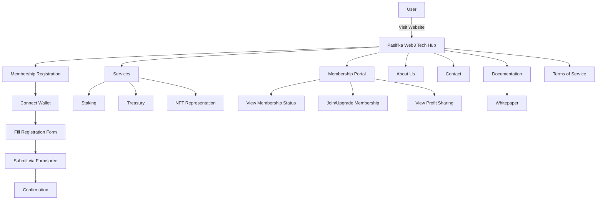
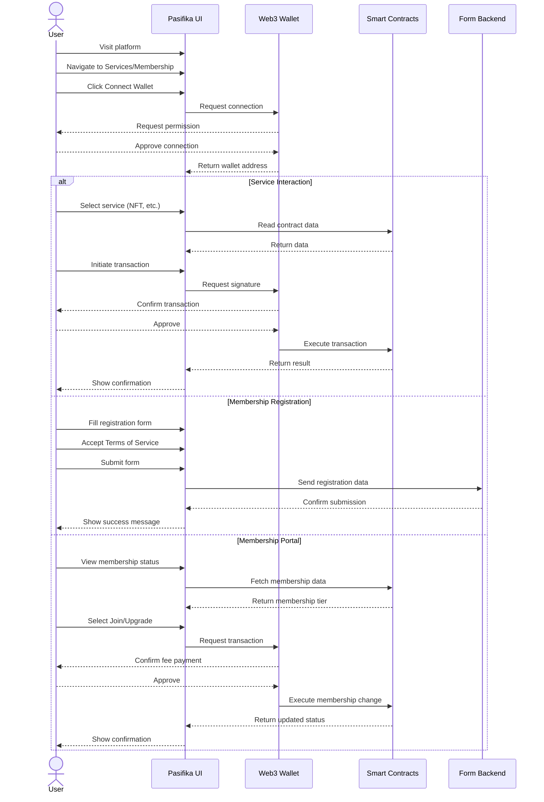

# Pasifika Web3 Tech Hub - Frontend

<div align="center">
  
  <h2>Building the Future of Pacific Island Web3 Technology</h2>
  <p><em>Established 2025</em></p>
  <hr />
</div>

A decentralized platform connecting Pacific Island communities to Web3 technologies.

## Overview

The Pasifika Web3 Tech Hub is a platform designed to empower Pacific Island communities through blockchain technology. Our mission is to build a decentralized digital ecosystem that addresses specific regional challenges while creating economic opportunities across the Pacific. Our production environment is now live on Arbitrum testnet.

## Technical Components

This project is built using:

- **Frontend**: Next.js 13.5 (App Router)
- **Styling**: Custom CSS with dark/light mode support
- **Web3 Integration**:
  - Wagmi library for Ethereum interactions
  - Dynamic Labs SDK for wallet connection
  - EIP-712 for typed data signing
  - Viem for smart contract interactions
- **Smart Contracts**:
  - Membership tiers (Guest, Member, Node Operator)
  - Staking contract
  - Treasury management with profit sharing program
  - Physical item NFT representation
- **Form Handling**:
  - Formspree for contact and registration submissions
  - Client-side validation with terms of service agreement
- **Deployments**:
  - Vercel-ready configuration
  - Static generation for performance optimization

## Features and Pages

The platform includes the following key features:

- **Home Page**: Team overview, platform introduction, blockchain infrastructure
- **Services**: Integration with smart contracts, user-friendly Web3 interactions
- **Membership Portal**: View membership status, join/upgrade tiers, profit sharing program
- **Membership Registration**: Web3 wallet connection, member profile creation
- **Terms of Service**: Comprehensive membership policies and platform rules
- **Documentation**: Whitepaper and technical resources
- **About Us**: Team details, mission, values
- **Contact**: Regional representatives, inquiry form

## Membership Tiers

The platform offers three membership tiers:

1. **Guest (Tier 0)**:
   - Free access
   - 1% transaction fee
   - No profit-sharing eligibility

2. **Member (Tier 1)**:
   - 0.005 ETH membership fee
   - 0.5% transaction fee
   - Profit-sharing eligibility
   - Governance participation

3. **Node Operator (Tier 2)**:
   - ETH staking required
   - 0.25% transaction fee
   - Priority access to services
   - Enhanced profit-sharing

## System Architecture



## User Flow Process



## Smart Contract Integration

The platform interacts with the following smart contracts deployed on Arbitrum:

1. **Membership Contract**: Manages membership tiers and access rights
2. **Staking Contract**: Token staking for rewards and governance rights
3. **Treasury Management**: Community fund management with profit sharing distribution
4. **Physical Item NFT**: Digital representation of physical assets

## Getting Started

### Local Development

1. Clone the repository:
```bash
git clone https://github.com/Pasifika-Web3-Tech-Hub/pasifika-web3-fe.git
cd pasifika-web3-fe
```

2. Install dependencies:
```bash
npm install
```

3. Run the development server:
```bash
npm run dev
```

4. Open [http://localhost:3000](http://localhost:3000) with your browser to see the result.

### Environment Setup

Create a `.env.local` file with the following variables:
```
NEXT_PUBLIC_CHAIN_ID=        # Arbitrum Chain ID
NEXT_PUBLIC_DYNAMIC_KEY=     # Dynamic API Key
NEXT_PUBLIC_MEMBERSHIP=      # Membership Contract Address
NEXT_PUBLIC_STAKING=         # Staking Contract Address
```

## Deployment

This project is configured for deployment on Vercel:

```bash
npm run build
```

## Future Roadmap

- Enhanced DAO governance features
- Mobile application development
- Integration with additional Pacific Island platforms
- Cross-chain support
- Expansion of marketplace functionality

<!-- trigger redeploy for 404.html SPA fix -->

<!-- trigger redeploy for .nojekyll fix -->
