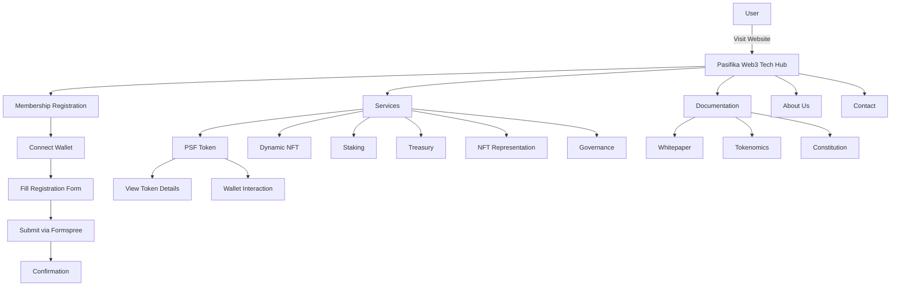
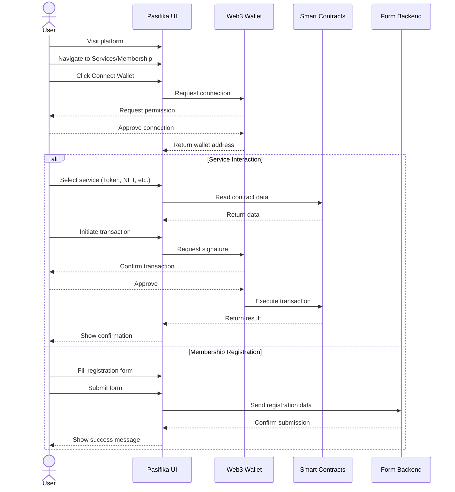

# Pasifika Web3 Tech Hub

<div align="center">
  
  <h2>Building the Future of Pacific Island Web3 Technology</h2>
  <p><em>Established 2025</em></p>
  <hr />
</div>

A decentralized platform connecting Pacific Island communities to Web3 technologies.

## Overview

The Pasifika Web3 Tech Hub is a Proof of Concept (POC) platform designed to empower Pacific Island communities through blockchain technology. Our mission is to build a decentralized digital ecosystem that addresses specific regional challenges while creating economic opportunities across the Pacific.

## Technical Components

This project is built using:

- **Frontend**: Next.js 13.5 (App Router)
- **Styling**: Custom CSS with dark/light mode support
- **Web3 Integration**:
  - Wagmi library for Ethereum interactions
  - Dynamic Labs SDK for wallet connection
  - EIP-712 for typed data signing
  - Viem for smart contract interactions
- **Smart Contracts**:
  - PSF token (ERC20) on Linea zkEVM
  - Dynamic NFT contract
  - Staking contract
  - Treasury management
  - Physical item NFT representation
  - DAO governance
- **Form Handling**:
  - Formspree for contact and registration submissions
  - Client-side validation
- **Deployments**:
  - Vercel-ready configuration
  - Static generation for performance optimization

## Features and Pages

The platform includes the following key features:

- **Home Page**: Team overview, platform introduction
- **Services**: Integration with smart contracts, user-friendly Web3 interactions
- **Membership Registration**: Web3 wallet connection, member profile creation
- **Documentation**: Whitepaper, Tokenomics, Constitution
- **About Us**: Team details, mission, values
- **Contact**: Regional representatives, inquiry form

## System Architecture



## User Flow Process



## Smart Contract Integration

The platform interacts with the following smart contracts deployed on the Linea zkEVM Layer-2 solution:

1. **PSF Token**: ERC-20 token with utility functions for the Pasifika ecosystem
2. **Dynamic NFT**: Evolving digital assets reflecting real-world achievements
3. **PSF Staking**: Token staking for rewards and governance rights
4. **Treasury Management**: Community fund management
5. **Physical Item NFT**: Digital representation of physical assets
6. **Governance**: DAO-based decision-making

## Getting Started

### Local Development

1. Clone the repository:
```bash
git clone https://github.com/Pasifika-Web3-Tech-Hub/pasifika-web3-fe.git
cd pasifika-web3-fe
```

2. Install dependencies:
```bash
npm install
```

3. Run the development server:
```bash
npm run dev
```

4. Open [http://localhost:3000](http://localhost:3000) with your browser to see the result.

### Environment Setup

Create a `.env.local` file with the following variables:
```
NEXT_PUBLIC_CHAIN_ID=        # Linea zkEVM Chain ID
NEXT_PUBLIC_DYNAMIC_KEY=     # Dynamic API Key
NEXT_PUBLIC_PSF_TOKEN=       # PSF Token Contract Address
NEXT_PUBLIC_DYNAMIC_NFT=     # Dynamic NFT Contract Address
NEXT_PUBLIC_STAKING=         # Staking Contract Address
```

## Deployment

This project is configured for deployment on Vercel:

```bash
npm run build
```

## Future Roadmap

- Enhanced DAO governance features
- Mobile application development
- Integration with additional Pacific Island platforms
- Cross-chain support
- Expansion of marketplace functionality
