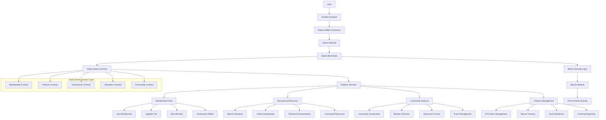
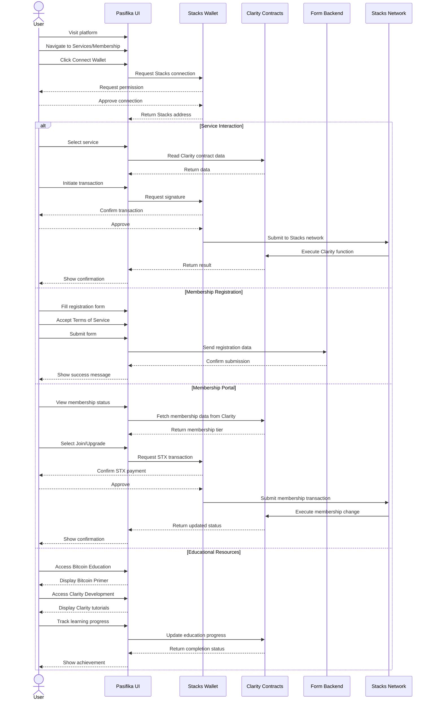

# Pasifika Web3 Tech Hub - Frontend

<div align="center">
  
  <h2>Building the Future of Pacific Island Web3 Technology</h2>
  <p><em>Established 2025</em></p>
  <hr />
  <p><strong>"If we take care of our own, they will take care of us"</strong></p>
</div>

A decentralized platform connecting Pacific Island communities to Web3 technologies built on Bitcoin's foundation, embodying Pacific values in digital form.

## Major Milestone Achieved!

We've just successfully completed **#Clarity #Camp** by the Stacks Foundation - diving deep into smart contracts built specifically for Bitcoin!

## Pacific Values in Digital Form

At the heart of Pasifika Web3 Tech Hub is a philosophical principle that has guided Pacific Island communities for generations: **"If we take care of our own, they will take care of us."** This powerful concept of reciprocity and community care isn't just a nice sentiment, it's the architectural blueprint for our entire system.

Bitcoin and the Stacks ecosystem, with their focus on decentralization, security, and community governance, provide the perfect technological expression of these Pacific values. When we examined various blockchain platforms, Bitcoin's proven security and Stacks' innovative approach to smart contracts aligned naturally with our cultural ethos.

## Strategic Transition to Stacks and Clarity

**Update: August 2025** - After years of building with Solidity and exploring various blockchain ecosystems, we've made the strategic decision to transition to **Stacks and Clarity** for our production infrastructure.

### Why Stacks and Clarity Matter

Clarity addresses **8 critical smart contract vulnerabilities** that have plagued the blockchain space, offering:

- **Predictable execution** - No unexpected gas costs or runtime errors
- **Enhanced security** - Built-in safety features and decidability  
- **Bitcoin alignment** - Designed specifically for Bitcoin's principles
- **Transparency** - Human-readable code that's easy to audit
- **Vulnerability prevention** - Eliminates common smart contract attack vectors

### Bitcoin: The Foundation of Digital Value
By building on Bitcoin through Stacks, we ensure that Pacific Island communities have direct access to the most robust and widely-adopted blockchain network in the world, while gaining access to advanced smart contract capabilities through Clarity.

### Stacks: Smart Contracts Secured by Bitcoin
Stacks enables smart contracts and decentralized applications that are secured by Bitcoin's proof-of-work consensus mechanism, providing the security of Bitcoin with the functionality of modern Web3 applications.

## Building the First Pacific Islands Web3 Platform on Bitcoin

### Upcoming Initiatives

**Bitcoin Education Cohort** - Launches August 25th, 2025  
**Clarity Development Cohort** - Coming soon  
**Migration Project** - Transitioning ALL our use cases and proofs of concepts from Solidity to Clarity for production

The technical architecture of our platform directly implements our community values through Bitcoin and Stacks functionality:

- **Stacks-Powered Platform**: Our platform leverages Stacks smart contracts secured by Bitcoin, providing advanced functionality with Bitcoin's security guarantees.

- **Clarity Smart Contracts**: All our smart contracts are built using Clarity, ensuring predictable execution, enhanced security, and transparency.

- **Bitcoin Integration**: Direct Bitcoin integration for payments, treasury management, and value storage, ensuring our platform is built on the most secure blockchain.

- **Tiered Membership System**: We've created a simplified 3-tier structure (Guest, Member, Node Operator) with graduated fee structures that reward deeper community involvement.

- **Transparent Fund Management**: Our Pasifika Treasury contract built in Clarity enables transparent, secure management of community funds with built-in safety features.

## Technical Stack

This project is built using:

### Frontend
- **Framework**: Next.js 13.5 (App Router)
- **Styling**: Custom CSS with dark/light mode support
- **Wallet Integration**: Stacks wallet support (Hiro Wallet, Xverse)
- **Blockchain Interaction**: Stacks.js for smart contract interactions

### Backend Integration
- **Smart Contracts**: Clarity contracts deployed on Stacks
- **Bitcoin Integration**: Direct Bitcoin network integration through Stacks
- **Authentication**: Stacks authentication and wallet connection
- **Data Storage**: Stacks blockchain for decentralized data storage

### Development Tools
- **Testing**: Clarinet for smart contract testing
- **Deployment**: Stacks testnet and mainnet deployment
- **Type Safety**: TypeScript throughout the application
- **Form Handling**: Formspree integration for contact and registration forms
- **Contract Sync**: Automated contract address synchronization
- **Development Server**: Next.js development environment

### UI/UX Features
- **Responsive Design**: Mobile and desktop optimized
- **Dark/Light Mode**: Theme toggle functionality
- **Loading States**: Comprehensive error handling and user feedback
- **Toast Notifications**: Real-time user notifications

### Key Platform Features
- **Home**: Landing page with platform overview and team information
- **Our Services**: Comprehensive service catalog including educational resources
- **Resources**: Bitcoin and Clarity educational content, whitepaper, and documentation
- **Membership Portal**: Tiered membership system with Stacks wallet integration
- **Contact**: Multi-regional contact information and inquiry forms
- **Terms of Service**: Comprehensive membership policies and platform rules
- **Documentation**: Technical resources and guides
- **About Us**: Team details, mission, values focused on Bitcoin and Stacks development
- **Stacks Exchange AMM**: Decentralized exchange for token swapping and liquidity provision

## Beyond the Technology: Cultural Significance

What truly sets our approach apart is how these technologies allow us to encode Pacific Island cultural values into digital infrastructure:

- **Reciprocity**: Just as traditional Pacific economies function on gift giving and mutual support, our profit sharing mechanism ensures value flows back to community members.

- **Shared Stewardship**: The graduated fee structure mirrors traditional systems where those with greater responsibility to the community receive greater benefits.
- **Accessibility**: By building on Bitcoin through Stacks, we ensure that participation remains accessible to all community members while maintaining the highest security standards.

## Membership Structure

Our membership structure reflects traditional Pacific governance systems, where leadership is earned through contribution and service to the community. The three-tier system mirrors the traditional roles found in Pacific societies:

- **Guests** represent visitors and newcomers who are welcomed but haven't yet committed to the community
- **Members** are those who have chosen to invest in the community's success and share in its prosperity
- **Node Operators** are the technical leaders who maintain the infrastructure and guide the community's technological direction

This isn't just a fee structure - it's a digital expression of Pacific values where greater contribution leads to greater responsibility and greater rewards.

## Our Commitment

This isn't just a tech stack change - it's the culmination of exploring multiple blockchain ecosystems and choosing the path that best serves our mission. We're committing to our pledge of **prioritizing Bitcoin** and building the most secure, reliable solutions for our Pacific community.

## Membership Tiers and Benefits

1. **Guest (Tier 0)**:
   - Basic platform access
   - Educational resources access
   - Bitcoin and Clarity learning materials

2. **Member (Tier 1)**:
   - STX token staking for membership
   - Reduced transaction fees
   - Profit-sharing eligibility
   - Community governance participation

3. **Node Operator (Tier 2)**:
   - Enhanced STX staking requirements
   - Priority access to services
   - Enhanced profit-sharing
   - Technical leadership opportunities

## System Architecture



## User Flow Process



## Clarity Smart Contracts

The platform leverages Clarity smart contracts deployed on the Stacks blockchain, secured by Bitcoin:

### Core Platform Contracts (Planned)
1. **Membership Contract**: Manages membership tiers and access rights with predictable execution
2. **Treasury Contract**: Community fund management with transparent, secure distribution mechanisms
3. **Governance Contract**: Community decision-making with built-in safety features
4. **Education Contract**: Tracks learning progress and certifications for Bitcoin and Clarity education
5. **Community Contract**: Manages community features, events, and member interactions

### Deployed AMM Contracts 

**Successfully deployed on Stacks Testnet:**
- **AMM Contract**: `ST1KQ3KDWYE3B4WMY0WQ7SP7EYX0842PR64K3DBE2.amm`
- **Mock Token**: `ST1KQ3KDWYE3B4WMY0WQ7SP7EYX0842PR64K3DBE2.mock-token`
- **Mock Token 2**: `ST1KQ3KDWYE3B4WMY0WQ7SP7EYX0842PR64K3DBE2.mock-token-2`

**Contract Features:**
- Automated Market Making with constant product formula
- Liquidity pool creation and management
- Token swapping functionality
- Fee collection and distribution
- Position tracking for liquidity providers

## Contract Integration

### Automated Contract Address Synchronization

The frontend automatically synchronizes with deployed smart contracts:

```bash
# Run contract synchronization script
node scripts/save-contract-addresses.js
```

**Generated Files:**
- `deployed_contracts/contract-addresses.json` - Contract metadata and addresses
- `deployed_contracts/contract-addresses.ts` - TypeScript definitions with helper functions
- `deployed_contracts/deployment-summary.json` - Deployment summary and statistics

**Usage in Components:**
```typescript
import { DEPLOYED_CONTRACTS, getContractAddress, getContractPrincipal } from './deployed_contracts/contract-addresses';

// Get contract address
const ammAddress = getContractAddress('amm', 'testnet');

// Get contract principal for transactions
const ammPrincipal = getContractPrincipal('amm');
```

### Development Workflow

1. **Start Development Server**
   ```bash
   npm run dev
   ```

2. **Sync Contract Addresses** (after backend deployment)
   ```bash
   node scripts/save-contract-addresses.js
   ```

3. **Build for Production**
   ```bash
   npm run build
   ```

4. **Serve Static Build**
   ```bash
   npx serve@latest out
   ```

## Resources

- [Clarity Language Reference](https://docs.stacks.co/clarity)
- [Stacks Documentation](https://docs.stacks.co/)
- [Clarinet Documentation](https://docs.hiro.so/clarinet)
- [Bitcoin Whitepaper](https://bitcoin.org/bitcoin.pdf)
- [Stacks.js Documentation](https://stacks.js.org/)
- [AMM Backend Repository](../pasifika-stacks-exchange/)

## The Future

**The future of Web3 in the Pacific is being built on Bitcoin's foundation, and we're leading that charge!**

Our mission extends beyond technology - we're building bridges between traditional Pacific communities and the decentralized future, ensuring that our values of community, sustainability, and security are embedded in every line of code.

## Getting Started

### Prerequisites
- Node.js (v16 or higher)
- npm or yarn
- Stacks wallet (Hiro Wallet or Xverse)

### Installation

1. **Clone the repository**
   ```bash
   git clone <repository-url>
   cd pasifika-web3-fe
   ```

2. **Install dependencies**
   ```bash
   npm install
   ```

3. **Sync contract addresses**
   ```bash
   node scripts/save-contract-addresses.js
   ```

4. **Start development server**
   ```bash
   npm run dev
   ```

5. **Open browser**
   Navigate to `http://localhost:3000`

## Connect With Us

- **Website**: https://pasifika.xyz/
- **Twitter**: [Coming Soon]
- **Discord**: [Coming Soon]
- **Email**: info@pasifika.xyz

