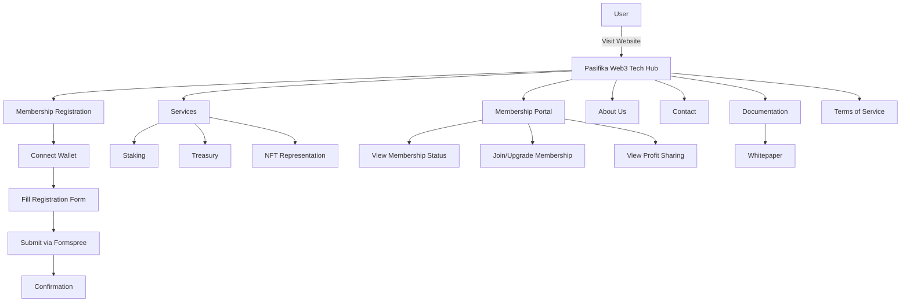
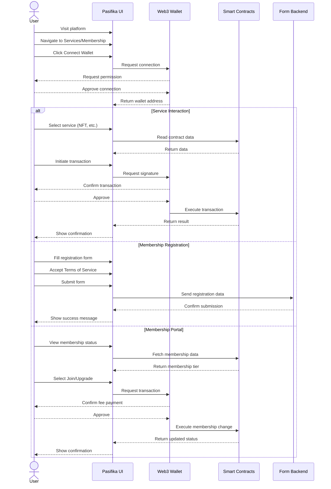

# Pasifika Web3 Tech Hub - Frontend

  
  <h2>Building the Future of Pacific Island Web3 Technology</h2>
  
<em>Established 2025</em>

  

  
<strong>"If we take care of our own, they will take care of us"</strong>

A decentralized multi-network platform connecting Pacific Island communities to Web3 technologies, embodying Pacific values in digital form.

## Pacific Values in Digital Form

At the heart of Pasifika Web3 Tech Hub is a philosophical principle that has guided Pacific Island communities for generations: **"If we take care of our own, they will take care of us."** This powerful concept of reciprocity and community care isn't just a nice sentiment, it's the architectural blueprint for our entire system.

Ethereum's ecosystem, with its focus on decentralization, community governance, and shared prosperity, provides the perfect technological expression of these Pacific values. When we examined various blockchain platforms, Ethereum EVM based chains aligned naturally with our cultural ethos.

## Technical Advantages of Our Multi-Chain Approach

Our platform operates across three complementary Ethereum EVM based chains: Linea, RSK (Rootstock), and Arbitrum. This wasn't a random selection, but a deliberate strategy to leverage the unique strengths of each:

### Linea: Scaling With Zero Knowledge
Linea's zkEVM Layer-2 technology dramatically reduces transaction costs while maintaining Ethereum's robust security model. For communities where every fraction of a cent matters, this efficiency is crucial for financial inclusion.

### RSK: Bitcoin Integration with Smart Contracts
As a Bitcoin sidechain, RSK allows us to work with RBTC (Bitcoin on RSK) while leveraging the programmability of smart contracts. Our treasury was initially seeded with 27,281 RIF tokens received from the RSK Hactivator program, showcasing the real-world support this technology brings to Pacific innovation.

### Arbitrum: Optimistic Rollups for Broader Integration
Arbitrum's optimistic rollup technology gives us additional scaling options and ensures our platform remains connected to the broader Ethereum ecosystem, expanding opportunities for Pacific Islanders.

## Building a Community Owned Financial System

The technical architecture of our platform directly implements our community values through smart contracts:

- **Tiered Membership System**: We've created a simplified 3-tier structure (Guest, Member, Node Operator) with graduated fee structures (1%, 0.5%, 0.25%) that reward deeper community involvement.

- **Annual Profit Sharing**: Every year from December 27 to December 24 (Pasifika Financial Year), 50% of treasury profits are distributed equally to all members, ensuring the community directly benefits from the platform's success.

- **Transparent Fund Management**: Our Pasifika Treasury contract enables transparent, secure management of community funds with multi-signature controls and clearly defined allocation processes.

## Technical Components

This project is built using:

- **Frontend**: Next.js 13.5 (App Router)
- **Styling**: Custom CSS with dark/light mode support
- **Multi-Network Support**:
  - Network-specific contract loading
  - Dynamic network switching
  - Cross-chain compatibility
- **Web3 Integration**:
  - Wagmi library for Ethereum interactions
  - Dynamic Labs SDK for wallet connection
  - EIP-712 for typed data signing
  - Viem for smart contract interactions
- **Smart Contracts**:
  - Membership tiers (Guest, Member, Node Operator)
  - Staking contract
  - Treasury management with profit sharing program
  - Physical item NFT representation
- **Form Handling**:
  - Formspree for contact and registration submissions
  - Client-side validation with terms of service agreement
- **Deployments**:
  - Vercel-ready configuration
  - Static generation for performance optimization

## Features and Pages

The platform includes the following key features:

- **Home Page**: Team overview, platform introduction, blockchain infrastructure
- **Services**: Integration with smart contracts, user-friendly Web3 interactions
- **Membership Portal**: View membership status, join/upgrade tiers, profit sharing program
- **Membership Registration**: Web3 wallet connection, member profile creation
- **Terms of Service**: Comprehensive membership policies and platform rules
- **Documentation**: Whitepaper and technical resources
- **About Us**: Team details, mission, values
- **Contact**: Regional representatives, inquiry form

## Beyond the Technology: Cultural Significance

What truly sets our approach apart is how these Ethereum EVM based technologies allow us to encode Pacific Island cultural values into digital infrastructure:

- **Reciprocity**: Just as traditional Pacific economies function on gift giving and mutual support, our profit sharing mechanism ensures value flows back to community members.

- **Shared Stewardship**: The graduated fee structure mirrors traditional systems where those with greater responsibility to the community receive greater benefits.

- **Accessibility**: By keeping fees low through Layer 2 scaling solutions, we ensure that participation remains accessible to all community members, regardless of economic status.

## Membership Tiers

The platform offers three membership tiers on each supported network:

1. **Guest (Tier 0)**:
   - Free access
   - 1% transaction fee
   - No profit-sharing eligibility

2. **Member (Tier 1)**:
   - Network-specific fee (0.005 ETH on Arbitrum/Linea, 0.0001 RBTC on RootStock)
   - 0.5% transaction fee (50% discount)
   - Profit-sharing eligibility
   - Governance participation

3. **Node Operator (Tier 2)**:
   - Native token staking required (ETH/RBTC)
   - 0.25% transaction fee (75% discount)
   - Priority access to services
   - Enhanced profit-sharing

## System Architecture

## User Flow Process

## Multi-Network Smart Contract Integration

The platform interacts with the following smart contracts deployed across multiple networks (Arbitrum, Linea, and RootStock):

1. **Membership Contract**: Manages membership tiers and access rights
2. **Staking Contract**: Token staking for rewards and governance rights
3. **Treasury Management**: Community fund management with profit sharing distribution
4. **Physical Item NFT**: Digital representation of physical assets
5. **Network-Specific Adapters**: Handle network-specific token operations and chain integration
